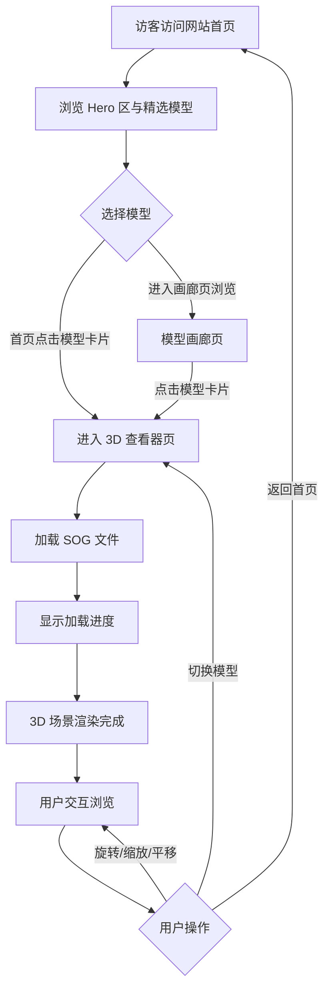

## 1. 产品概述

一个基于 Web 的 3D 高斯泼溅（3D Gaussian Splatting）模型在线展示平台，支持 SOG 格式文件的加载、渲染与交互浏览。面向 3D 内容创作者、扫描服务商及普通用户，提供轻量级、无需安装的沉浸式 3D 场景浏览体验。

## 2. 核心功能

### 2.1 用户角色
| 角色 | 注册方式 | 核心权限 |
|------|---------|---------|
| 访客用户 | 无需注册 | 浏览展示页、查看 3D 模型、交互操作 |

### 2.2 功能模块
1. **首页**：Hero 区、模型画廊、导航栏
2. **3D 查看器页**：3D 高斯泼溅实时渲染、模型信息面板、交互控制
3. **模型画廊页**：模型列表/卡片网格、筛选与搜索

### 2.3 页面详情
| 页面名称 | 模块名称 | 功能描述 |
|---------|---------|---------|
| 首页 | Hero 区 | 展示平台名称与简介，3D 背景动画粒子效果，引导用户进入查看器 |
| 首页 | 模型画廊预览 | 精选模型卡片横向滚动展示，点击进入对应查看器 |
| 首页 | 导航栏 | 固定顶部导航，包含 Logo、导航链接（首页、画廊、关于） |
| 3D 查看器页 | 3D 渲染画布 | 全屏 Three.js + Spark 渲染引擎，实时显示高斯泼溅模型，支持 SOG 格式 |
| 3D 查看器页 | 相机控制 | 鼠标/触控旋转、缩放、平移；支持轨道控制（Orbit Controls） |
| 3D 查看器页 | 模型信息面板 | 侧边栏显示模型名称、高斯点数、文件大小等元数据 |
| 3D 查看器页 | 工具栏 | 重置视角、线框模式切换、截图导出、全屏切换 |
| 3D 查看器页 | 模型加载进度 | 加载进度条显示 SOG 文件加载百分比 |
| 模型画廊页 | 模型卡片网格 | 缩略图+模型名称+描述，响应式网格布局 |
| 模型画廊页 | 筛选/搜索 | 按名称搜索模型 |

## 3. 核心流程

## 4. 用户界面设计

### 4.1 设计风格

- **主题色调**：深色科技风（Dark Tech），主色 `#0a0a0f` 深黑蓝底色，辅色 `#6C5CE7` 亮紫，强调色 `#00D2FF` 青色
- **字体**：标题使用 **Orbitron**（几何感科技字体），正文使用 **Noto Sans SC**（中文可读性好）
- **按钮风格**：玻璃拟态（Glassmorphism），半透明背景 + 模糊边框 + 悬停发光效果
- **布局风格**：沉浸式全屏体验，最小化 UI 干扰，关键控制浮于 3D 画布之上
- **图标风格**：线性图标（Lucide Icons），与科技风主题统一

### 4.2 页面设计概览
| 页面名称 | 模块名称 | UI 元素 |
|---------|---------|--------|
| 首页 | Hero 区 | 全屏 3D 粒子背景，中央大标题 + 副标题 + CTA 按钮，向下滚动指示箭头 |
| 首页 | 模型画廊预览 | 水平滚动卡片，毛玻璃背景卡片，模型缩略图 + 名称 + 标签，悬停放大效果 |
| 首页 | 导航栏 | 固定顶部，半透明模糊背景，左侧 Logo，右侧导航链接，当前页高亮 |
| 3D 查看器页 | 3D 渲染画布 | 占据全部视口，深色背景，模型居中显示 |
| 3D 查看器页 | 顶部工具栏 | 左上角返回按钮 + 模型标题，右上角工具按钮组（半透明圆形按钮） |
| 3D 查看器页 | 底部信息栏 | 半透明状态条，显示加载进度 / FPS / 高斯点数 |
| 3D 查看器页 | 侧边面板 | 右侧滑出面板，包含模型元数据、控制选项 |
| 模型画廊页 | 模型卡片网格 | 响应式网格，3-4 列自适应，卡片含缩略图占位 + 渐变遮罩 + 文字叠加 |

### 4.3 响应式设计
- **桌面端优先**（Desktop-First）：1920px / 1440px / 1280px 断点
- **移动端适配**：工具栏折叠为汉堡菜单，控制面板全屏覆盖，触摸手势支持

### 4.4 3D 场景指导
- **环境光照**：使用 Three.js 环境贴图 / 纯色环境光，偏冷色调，营造科技感空间氛围
- **相机设置**：透视相机 FOV 60°，初始距离根据模型包围盒自动适配
- **相机运动**：OrbitControls 带阻尼惯性，支持自动旋转选项
- **交互**：鼠标拖拽旋转、滚轮缩放、右键平移；移动端支持单指旋转、双指缩放/平移
- **后处理**：可选 Bloom 发光效果（通过 EffectComposer），增强视觉冲击力
- **资源来源**：SOG 文件支持本地拖拽上传和远程 URL 加载；使用 `@sparkjsdev/spark` 进行渲染
- **性能预算**：目标 60fps（桌面端），30fps（移动端）；单个模型高斯点数上限约 500 万