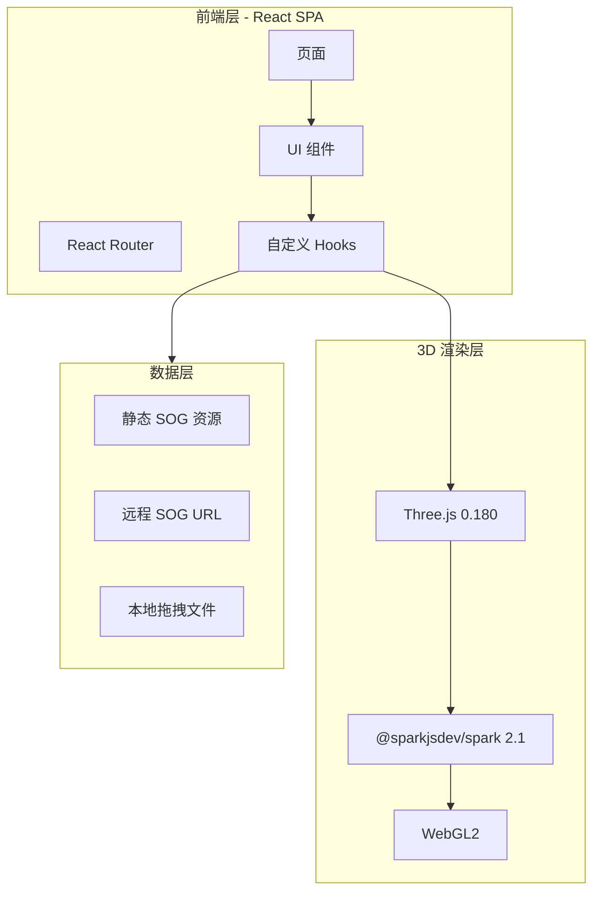
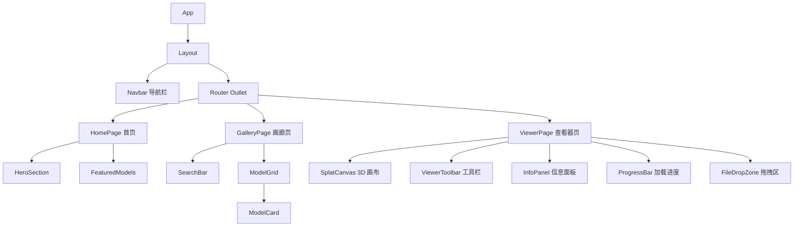
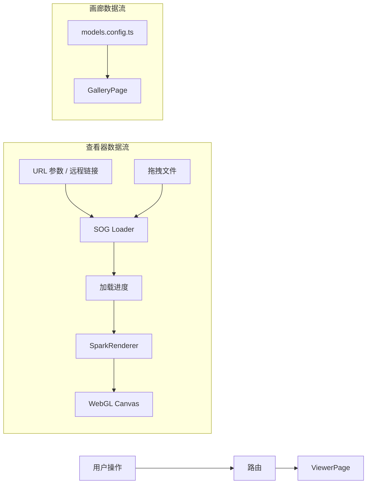

## 1. 架构设计



## 2. 技术选型

| 层级 | 技术 | 版本 | 说明 |
|------|------|------|------|
| 前端框架 | React | ^18 | 组件化 UI 开发 |
| 构建工具 | Vite | ^6 | 快速 HMR 开发服务器 |
| 样式方案 | TailwindCSS | ^4 | 原子化 CSS，快速构建 |
| 类型系统 | TypeScript | ^5 | 类型安全 |
| 路由 | react-router-dom | ^7 | 客户端路由 |
| 图标库 | lucide-react | latest | 线性图标 |
| 3D 引擎 | three | 0.180.0 | WebGL 3D 渲染框架 |
| 高斯泼溅渲染 | @sparkjsdev/spark | ^2.1.0 | THREE.js 原生高斯泼溅渲染器，支持 SOG |
| 初始化工具 | Vite | latest | `npm create vite@latest` |

## 3. 路由定义

| 路由 | 页面 | 说明 |
|------|------|------|
| `/` | 首页 | Hero 区 + 精选模型画廊预览 + 导航 |
| `/gallery` | 模型画廊页 | 全部模型卡片网格展示 + 搜索筛选 |
| `/viewer` | 3D 查看器页 | 加载并渲染 SOG 模型，支持 URL 参数 `?src=<sog_url>` 和拖拽上传 |

## 4. 组件树



## 5. 数据流设计



## 6. 数据模型

### 6.1 模型配置定义

```typescript
interface ModelEntry {
  id: string
  name: string
  description: string
  /** SOG 文件的 URL 或本地路径 */
  sogUrl: string
  /** 缩略图 URL（可选，可用占位图） */
  thumbnail?: string
  /** 标签分类 */
  tags: string[]
  /** 高斯点数量（加载后获取） */
  splatCount?: number
}

interface ViewerState {
  isLoading: boolean
  progress: number
  error: string | null
  splatCount: number
  fps: number
  isWireframe: boolean
}
```

### 6.2 模型配置示例（Mock 数据）

```typescript
const models: ModelEntry[] = [
  {
    id: 'demo-garden',
    name: '花园场景',
    description: '一个精美的户外花园 3D 高斯泼溅重建',
    sogUrl: '/assets/models/garden.sog',
    tags: ['户外', '自然', '演示'],
  },
  // ...更多模型
]
```

## 7. 项目目录结构

```
gaussian-splat-showcase/
├── index.html
├── package.json
├── tsconfig.json
├── vite.config.ts
├── tailwind.config.ts
├── public/
│   └── assets/
│       └── models/          # SOG 模型文件存放
├── src/
│   ├── main.tsx
│   ├── App.tsx
│   ├── index.css            # 全局样式 + TailwindCSS
│   ├── routes/
│   │   └── index.tsx        # 路由配置
│   ├── pages/
│   │   ├── HomePage.tsx
│   │   ├── GalleryPage.tsx
│   │   └── ViewerPage.tsx
│   ├── components/
│   │   ├── layout/
│   │   │   ├── Layout.tsx
│   │   │   └── Navbar.tsx
│   │   ├── home/
│   │   │   ├── HeroSection.tsx
│   │   │   └── FeaturedModels.tsx
│   │   ├── gallery/
│   │   │   ├── ModelCard.tsx
│   │   │   └── SearchBar.tsx
│   │   └── viewer/
│   │       ├── SplatCanvas.tsx
│   │       ├── ViewerToolbar.tsx
│   │       ├── InfoPanel.tsx
│   │       ├── ProgressBar.tsx
│   │       └── FileDropZone.tsx
│   ├── hooks/
│   │   ├── useSplatViewer.ts  # 核心 SOG 加载与渲染逻辑
│   │   └── useFPS.ts          # FPS 计算
│   ├── data/
│   │   └── models.ts          # 模型配置数据
│   └── types/
│       └── index.ts           # 类型定义
```

## 8. 关键技术实现要点

### 8.1 SOG 加载与渲染
- 使用 `@sparkjsdev/spark` 的 `SplatMesh` + `SparkRenderer` 组件
- `SplatMesh` 接受 `{ url: string }` 参数直接加载远程 SOG 文件
- 支持通过 `FileReader` 读取本地 `.sog` 文件并转为 Blob URL 加载

### 8.2 相机控制
- 使用 Three.js `OrbitControls`，带阻尼惯性
- 模型加载完成后自动计算包围盒并调整相机位置

### 8.3 性能优化
- FPS 监控与显示
- 使用 `requestAnimationFrame` 驱动渲染循环
- 组件卸载时清理 Three.js 资源（dispose）

### 8.4 无后端架构
- 纯静态前端，无需后端服务器
- 模型文件通过 CDN / 远程 URL 或本地文件加载
- 部署到任意静态托管（Vercel / Netlify / GitHub Pages）